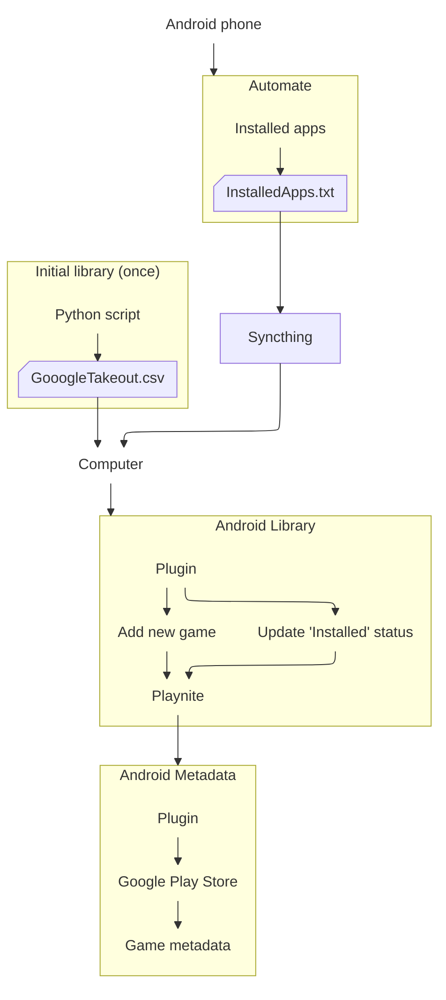

# Playnite Android Integration

A set of 2 playnite plugins that integrates Android games into [Playnite](https://playnite.link/).

The project is designed to maintain an Android game library in Playnite while automatically keeping the **installed / not installed** status synchronized with an Android device.

## Features

* Import Android games into Playnite using their Android package name.
* Keep Android games permanently in the Playnite library, even when they are not installed on the device.
* Automatically update the **Installed** status from an Android-generated list.
* Use the Android package name as the unique game identifier.
* Retrieve metadata for Android games through a dedicated metadata provider.
* Keep the library and metadata functionality separated into two standard Playnite plugins.

## Architecture

The project contains two independent Playnite plugins:

### Android Library Plugin

The Library Plugin is responsible for:

* Creating Android games in Playnite.
* Using the Android package name as `GameId`.
* Reading the list of installed applications generated on the Android device.
* Updating the `Installed` property of Android games.

### Android Metadata Plugin

The Metadata Plugin is responsible for retrieving metadata for Android games.

It receives the Android package name from Playnite and can use it to identify the corresponding game and retrieve information such as:

- PackageName
- Name
- Description
- IconUrl
- Developer
- DeveloperUrl
- Category
- AgeRating
- Rating
- RatingCount
- Price
- Currency

Keeping this functionality separate from the Library Plugin follows Playnite's plugin model and allows each plugin to have a single responsibility.

## Installation

### 1. Process to automatically generate CSV file from your phone

The Android automation tool [Automate](https://play.google.com/store/apps/details?id=com.llamalab.automate&hl=fr) generates a text file containing the package, the name and the last timestamp for each currently installed application:

```csv
com.chucklefish.stardewvalley,Stardew Valley,1.790365626798E9
io.anuke.mindustry,Mindustry,
com.sadpuppy.lemmings,Lemmings,
...
```

Here is the [Automate flow](/Sync%20game%20list.flo) I use to generate the file.


### 2. Synchronise the file to your computer

The file is synchronized to the computer running Playnite, using [syncthing](https://syncthing.net/)


### 3. Playnite - Library Plugin

Install the [two `.pext` package files](https://github.com/FunkyKwak/playnite-android/releases/latest) in Playnite:

1. Double-clic on each package file
2. Restart Playnite when requested
3. In the library plugin settings, set the csv file path:

    

The two plugins are independent and can be updated separately.


## Initial import (optional)

If you want to import all games you've played on your Android phone before, and uninstalled afterwise, you can do the following:
1. [Google Takeout](https://takeout.google.com/): Export "Google Play Games services" and "Google Play Store"
2. Generate a CSV out of it, using the python script [ExtractCsvFromGoogleTakeOut.py](/AndroidCommon/ExtractCsvFromGoogleTakeOut.py)
3. Use the generated file in the Android Library plugin settings (restart Playnite)
4. Sync Android games
    &rarr; all games will be added to your Playnite library and marked as installed. They will be updated as not installed on the next sync with the csv file from your phone


## How it works

### How the plugin works

The Library Plugin compares the CSV file with the Android games already present in Playnite:
- Playnite game found in the CSV file &rarr; Installed = true
- Playnite game not found in the CSV file &rarr; Installed = false

If the game is not present in the Playnite library, it adds it and get Metadata using the information scrapped on the Google Play store.


<details>
<summary>Example</summary>

Suppose the Playnite library contains:

| Game           | Android package                 | Installed |
| -------------- | ------------------------------- | --------: |
| Stardew Valley | `com.chucklefish.stardewvalley` |       Yes |
| Moonlight      | `com.limelight`                 |       Yes |
| Game A         | `com.example.gamea`             |        No |
| Game B         | `com.example.gameb`             |        No |

Automate then generates:

```text
com.chucklefish.stardewvalley
com.example.gameb
```

After synchronization, Playnite becomes:

| Game           | Installed |
| -------------- | --------: |
| Stardew Valley |       Yes |
| Moonlight      |        No |
| Game A         |        No |
| Game B         |       Yes |

Games that are not installed are **not removed from Playnite**. They remain part of the library and are simply marked as not installed.
</details>

<details>
<summary>Why use the package name?</summary>

Android package names provide a stable and unambiguous identifier.

For example:

```text
com.chucklefish.stardewvalley
```

is much more reliable for identifying an Android game than its display name:

```text
Stardew Valley
```

This is particularly useful for metadata lookup because game names can be ambiguous or shared by multiple versions.

The package name is therefore used as the Playnite `GameId`.
</details>

### Data flow



